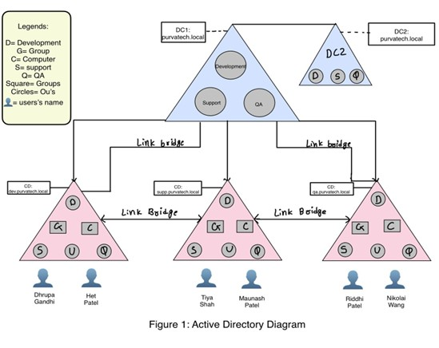
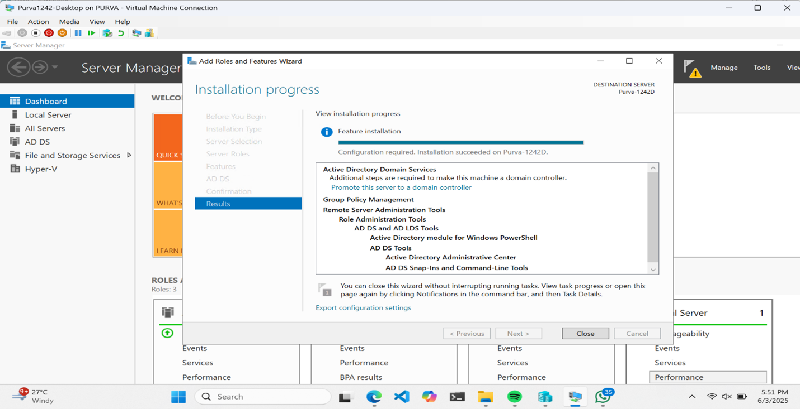
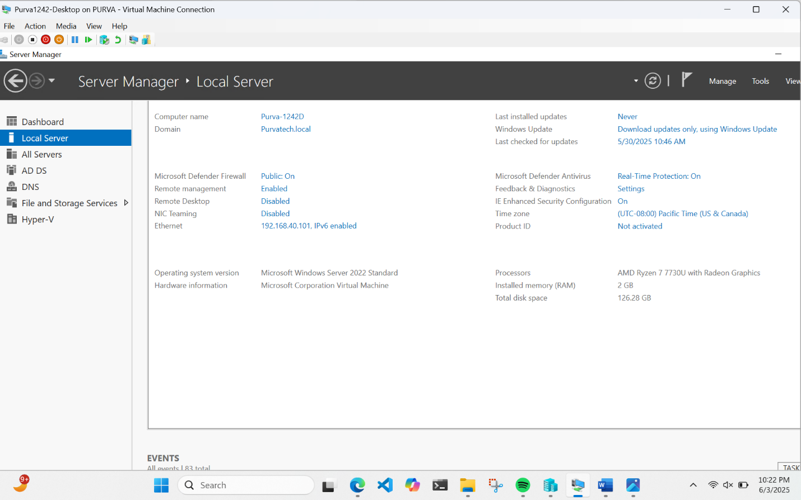
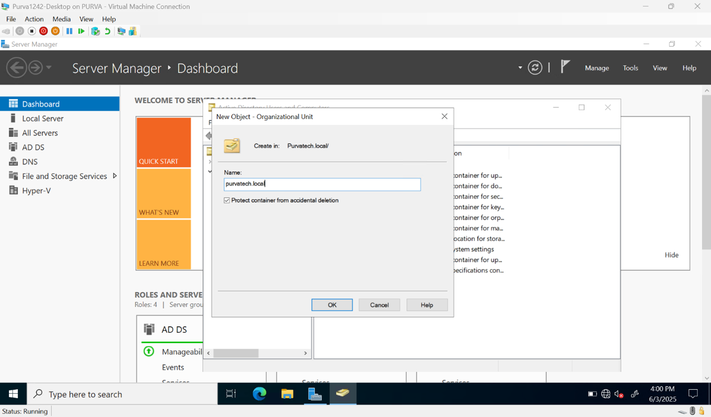
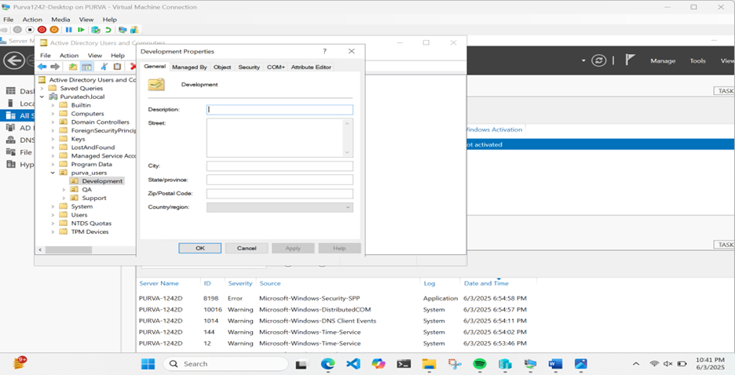
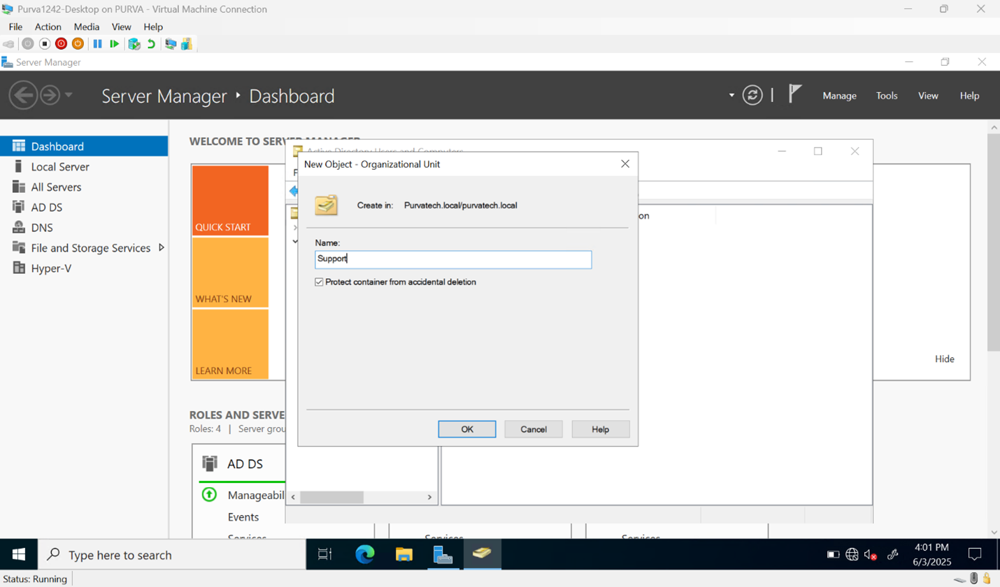
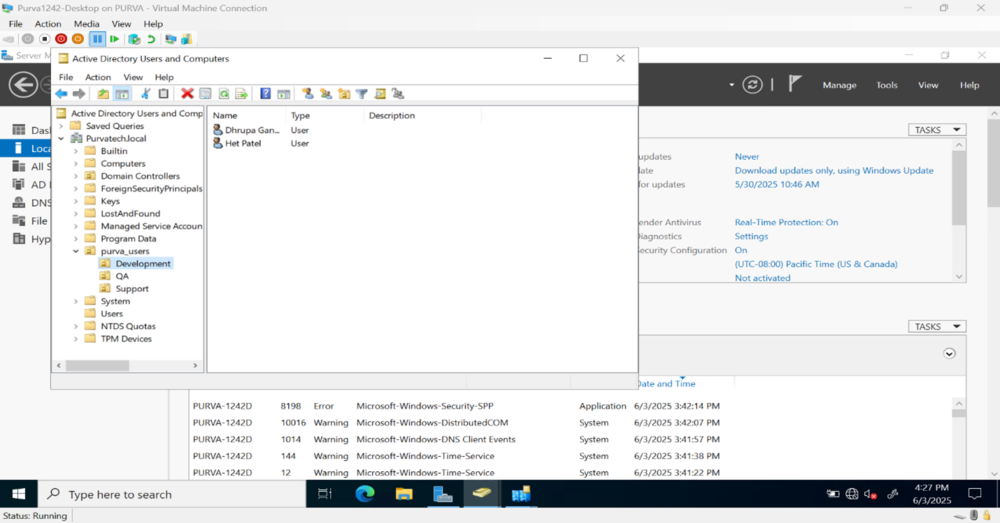
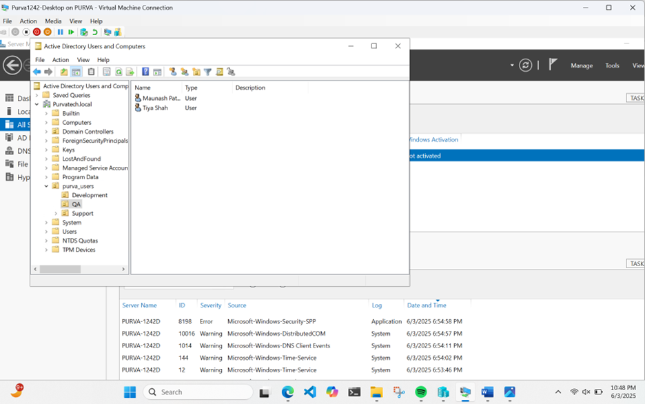
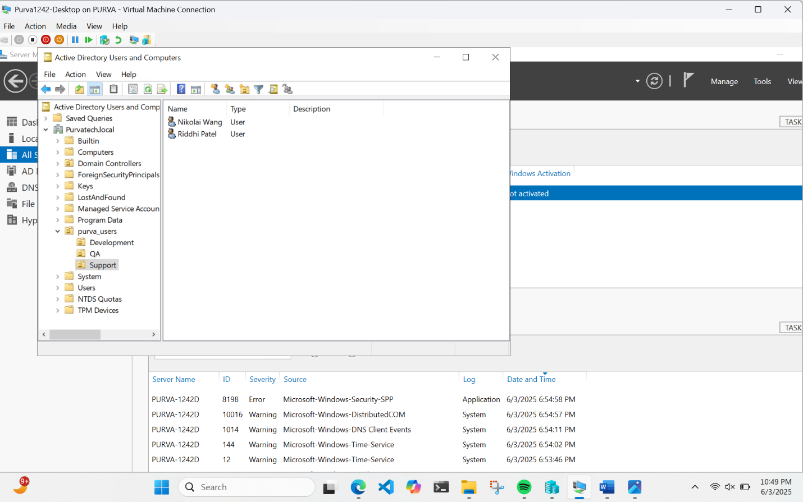

# 💼 Active Directory Multi-Domain Design

In this project, I designed and implemented an **Active Directory environment** that represents how a real organization manages its **departments, users, and domain structure**.

I started by setting up a **root domain** called **purvatech.local**, which is managed by the **primary domain controller (DC1)**. To improve reliability and ensure the system remains available even if one server fails, I also configured a **secondary domain controller (DC2)**. Both controllers work together and stay synchronized through **replication**.

Within the root domain, I organized the system into three main departments **Development, Support, and QA** using **Organizational Units (OUs)**. These OUs help separate users based on their roles, making it easier to manage **access** and apply **policies**.

To simulate a more realistic enterprise environment, I created three **child domains**:

- **dev.purvatech.local**  
- **supp.purvatech.local**  
- **qa.purvatech.local**  

Each child domain represents a specific department and contains:

- **Users**  
- **Groups**  
- **Computers**  

This structure allows each department to operate independently while still being connected to the main domain.

I also configured **link bridges** between domains to ensure proper **communication and connectivity** across the entire environment. This helps maintain smooth data flow and supports **authentication** between different domains.

Each department has its own set of users:

- **Development:** Dhrupa Gandhi, Het Patel  
- **Support:** Tiya Shah, Maunash Patel  
- **QA:** Riddhi Patel, Nikolai Wang  

The overall goal of this project was to build a system that is:

- **Well-structured and organized**  
- **Easy to manage by department**  
- **Scalable for future growth**  
- **Reliable with multiple domain controllers**  
- **Suitable for implementing access control and security policies**  

Through this project, I gained hands-on experience in **Active Directory design, domain hierarchy, user management, and enterprise-level identity structure**.

---

## ⚙️ Step 1: Installing Active Directory Domain Services (AD DS)

In this step, I started by installing the **Active Directory Domain Services (AD DS)** role on my Windows Server machine named **Purva-1242D** using **Server Manager**.

I used the **Add Roles and Features Wizard** to select and install the AD DS role along with the required management tools. The installation completed successfully without any errors, which confirmed that the server is now ready for the next stage.

Along with AD DS, additional components such as:

- **Group Policy Management**  
- **AD DS Administrative Tools**  
- **PowerShell modules**  

were also installed automatically. These tools are important for managing **users, policies, and directory services**.

At this point, the server is not yet a **domain controller**, but it is fully prepared to be promoted into one in the next step.

## ⚙️ Step 2: Verifying Server Configuration

After installing the Active Directory Domain Services (AD DS) role, I verified the server configuration using the **Local Server** section in Server Manager.

I confirmed that the server was successfully connected to the domain **purvatech.local**, which indicates that the domain setup is active and functioning correctly.

I also reviewed important system details, including:
- Computer name: Purva-1242D  
- Domain: purvatech.local  
- Firewall status  
- Remote management settings  
- IP address configuration  
- Operating system: Windows Server 2022  

This step ensured that the server environment is stable and properly configured before proceeding with further Active Directory setup tasks such as domain management, OU creation, and user configuration.

## ⚙️ Step 3: Creating Organizational Unit (OU)

In this step, I created an Organizational Unit (OU) in Active Directory under the domain purvatech.local.

I used the Active Directory Users and Computers console to create a new OU. Organizational Units are used to organize users and resources based on departments or roles.

This helps in managing users more efficiently and allows applying Group Policies to specific groups within the organization.

## ⚙️ Step 4: Creating Organizational Units (OUs)

In this step, I created multiple **Organizational Units (OUs)** in **Active Directory** under the domain **purvatech.local**.

I used the **Active Directory Users and Computers (ADUC)** console to create separate OUs for:

- **Development**
- **Support**
- **QA**

These OUs help in **organizing users by department**, making it easier to manage **access control** and apply **Group Policies (GPOs)** efficiently.

This structure improves **administrative control** and supports **scalability** in a real-world enterprise environment.

## ⚙️ Step 5: Adding Users to Organizational Units

In this step, I created and added **users** in **Active Directory** under their respective **Organizational Units (OUs)**.

I used the **Active Directory Users and Computers (ADUC)** console to assign users based on their departments:

- **Development:** Dhrupa Gandhi, Het Patel  
- **Support:** Tiya Shah, Maunash Patel  
- **QA:** Riddhi Patel, Nikolai Wang  

This setup helps in **organizing users**, improving **access control**, and making it easier to apply **Group Policies (GPOs)** for each department.

It also reflects a **real-world enterprise structure**, where users are grouped based on roles and responsibilities.

## ⚙️ Step 6: Final Organizational Unit Structure Verification

In this step, I verified the complete **Organizational Unit (OU) structure** in **Active Directory** using the **Active Directory Users and Computers (ADUC)** console.

The final structure includes:

- **Development OU**
- **Support OU**
- **QA OU**

Each OU contains users organized based on their respective departments.

This verification confirms that the **directory structure is properly configured**, ensuring efficient **user management**, **access control**, and readiness for applying **Group Policies (GPOs)**.

The setup reflects a **real-world enterprise environment**, where users and resources are structured logically for better administration and scalability.

